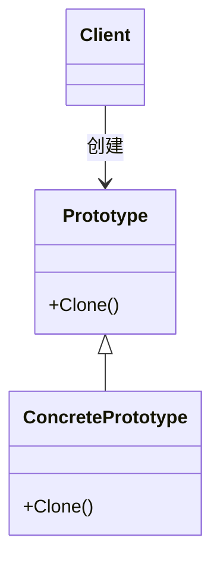

# 1. 原型模式

## 1.1 概述

原型模式就像用复印机复印文件 —— 你有一份 “原型” 文件，直接复印就能得到一模一样的新文件，比重新写一份快得多！在编程里，就是当创建对象很耗时或复杂时，直接复制已有对象来节省时间。

比如游戏里的 “怪物”，每个怪物属性都差不多，不用每次都重新设计，直接复制 “原型怪物” 就行。

原型模式具有下面的优点：

1. **性能提高**：比如你要画 100 个 “圆形”，每个圆形都要重新计算半径、颜色、位置，很耗时。但如果有一个 “原型圆形”，直接复制它，修改位置和颜色，就快多了！
2. **避免构造函数的约束**：有些对象创建时需要很多参数，比如 “创建一个用户，需要用户名、密码、邮箱、生日、头像...”。用原型模式，直接复制一个已有用户，再改部分信息，就不用每次都填一堆参数。

但它也具有一些缺点：

1. **复制复杂对象难**：如果对象里有 “不能直接复制的东西”，比如：对象里有 “打开的文件”“网络连接”（复制后这些连接还能用吗？）这时候复制就很麻烦，要专门处理。


原型式主要有以下**主要角色**：

1. 原型类：包括原型的抽象类和具体实现类，抽象类需要提供如`Clone`的接口。
2. 客户端：通过调用原型类的`Clone`方法来复制新对象。


其类图可以表示为：



解释一下这个图：
1. `Client`创建`ConcretePrototype`的实例
2. `Client`调用`ConcretePrototype`的`Clone`方法来创建新的`ConcretePrototype`实例。


## 1.2 代码实现

先定义Prototype的抽象类：

```cpp
class Prototype {
public:
    virtual ~Prototype() {}
    virtual Prototype* Clone() const = 0;
    virtual void ShowInfo() const = 0;
};
```

然后定义ConcretePrototype的具体类：

```cpp
class ConcretePrototype : public Prototype {
public:
    ConcretePrototype(Type elem1_, Type elem2_) : m_elem1(elem1_), m_elem2(elem2_) {}
    ~ConcretePrototype() {}
    Prototype* Clone() const override {
        return new ConcretePrototype(*this);
    }
    void ShowInfo() const override
    {
        cout << m_elem1 << " " << m_elem2 << endl;
    }
private:
    Type m_elem1;
    Type m_elem2;
};
```

接着我们使用原型模式：
```cpp
int main() {
    // 创建原型对象
    Prototype* prototype = new ConcretePrototype(1, 2);

    // 复制原型对象
    Prototype* clonedPrototype = prototype->Clone();

    // 打印原型对象和复制对象的信息
    cout << "Prototype: " << prototype->ShowInfo() << ndl;
    cout << "Cloned Prototype: " << clonedPrototype->ShowInfo() << endl;
}
```

# 1.3 问题：有了拷贝构造函数为什么还要有原型模式呢

要搞懂这个问题，我们可以先把“拷贝构造函数”和“原型模式”当成两种“复制东西”的工具，就像生活里的“手动抄题”和“自动复印机”——虽然都能复制，但用法和场景完全不同。


先回忆两个核心概念：**拷贝构造函数**和**原型模式**。

1. **拷贝构造函数**：就像“照着作业本手动抄题”。比如你有一本作业本A，想弄个一模一样的作业本B，就得拿着A逐行抄到B上。在编程里，它是一个特殊的函数，作用是“用一个已有的对象，创建一个新对象”（比如用`Student b(a)`创建和`a`一样的`b`）。

2. **原型模式**：就像“用复印机自动复印”。你把作业本A放进复印机，按一下按钮就得到B，不用自己动手抄。在编程里，它是一种“设计套路”：给对象加一个“复制自己”的方法（比如`clone()`），想复制时直接调用这个方法就行。


为什么有了拷贝构造函数，还要原型模式？

举个生活例子你就懂了：  

假设你是班长，老师让你复制100份“作业模板”发给同学。  

- 如果用“拷贝构造函数”（手动抄）：你得拿着原始模板，每次都手动抄一份新的——抄第1份、第2份……第100份，每次都要重复“拿纸、抄题”的动作，很麻烦。
  
- 如果用“原型模式”（复印机）：你只需要把原始模板放进复印机，按100次“复制”按钮就行——机器会自动处理“拿纸、复制”的过程，你不用管细节。  


对应到编程里，核心区别有3点：

+ 1.灵活性不同：原型模式能“动态复制”

拷贝构造函数就像“提前知道要抄什么题”——必须明确知道要复制的对象类型（比如知道是`Student`类的对象），才能用`Student b(a)`复制。  

但原型模式像“不管抄什么题，都能用复印机”——就算不知道对象具体是啥类型，只要它有“复制自己”的方法，就能直接调用。比如游戏里有10种怪物（狼、龙、骷髅等），你不用管它是哪种，只要调用`怪物.clone()`，就能复制出对应的新怪物。


+ 2.复用性不同：原型模式能“批量管理复制逻辑”

拷贝构造函数的复制逻辑（比如怎么复制对象的属性），是写在每个类里的（每个类都要自己写拷贝构造函数）。如果10个类都要复制，就得写10个拷贝构造函数，改的时候也要一个个改。  

原型模式是把“复制逻辑”统一成一个规则（比如所有可复制的对象都实现`clone()`方法），就像给所有作业本都标上“可复印”，需要复制时统一用“复印机”（调用`clone()`），改逻辑时只要改`clone()`方法就行，不用每个类都动。


+ 3.适用场景不同：原型模式适合“复杂对象批量复制”

如果只是偶尔复制一个简单对象（比如复制一个只有“姓名、年龄”的`Student`），用拷贝构造函数很方便，就像抄1道题，手动抄更快。  

但如果要复制“复杂对象”（比如一个有100个属性的“游戏角色”，甚至里面还包含其他对象，比如装备、技能），或者要批量复制（比如一次复制100个），原型模式更合适——就像抄100页的题，肯定用复印机比手动抄快。

总结一下：拷贝构造函数是“单个对象的基础复制工具”，就像手动抄题；原型模式是“批量/动态复制的高级工具”，就像复印机。  

简单复制用拷贝构造函数够了，但遇到“不知道复制什么类型”“要复制很多个”“对象很复杂”的情况，原型模式更方便——这就是为什么两者都需要。